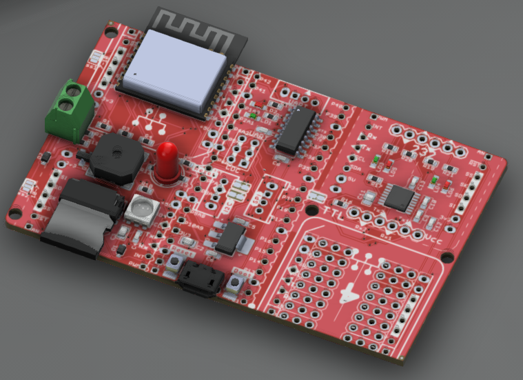
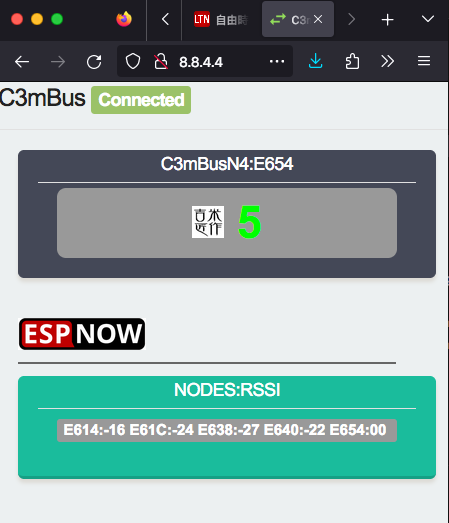

# C3WroomPicoRS232
An updated/proved ESP32C3 Bitslash/EspNOW project.  
As the original 12F compatible module no more supported, changes to the Espressif C3Wroom-N4-1; w/ RS232 converter. 

  
 
---
EspNow time-sync happily work within 5 pcs boards! (auto drop/add nodes-configure)  
 

---
Next step to add ESP32C3mini-1 for smaller module... 
  - [C3WroomMini plan] (https://github.com/jmysu/C3WroomPicoRS232/blob/main/C3mBus2023wroomN4.pdf) 
 
 

---
## Added ESPUI for the ESPNOW Dashboard
  
  
 
 

---

## References
  - [Bitlash](http://bitlash.net/) A programmable command shell for arduino.  
    [Bitlash user guide](https://github.com/jmysu/C3WroomPicoRS232/blob/main/PlatformIO/C3mBusN4_Bitlash/bitlash-users-guide.pdf)
  - [TinyBasic+](https://github.com/BleuLlama/TinyBasicPlus) A C implementation of Tiny Basic.  
  - [Quick EspNOW](https://github.com/gmag11/QuickESPNow) A wireless protocol that allows devices links without network.
  - [ESP-NOW An_efficient_networking_solution](PlatformIO/C3mBusN4_Bitlash/An_efficient_networking_solution_for_extending_and.pdf)
